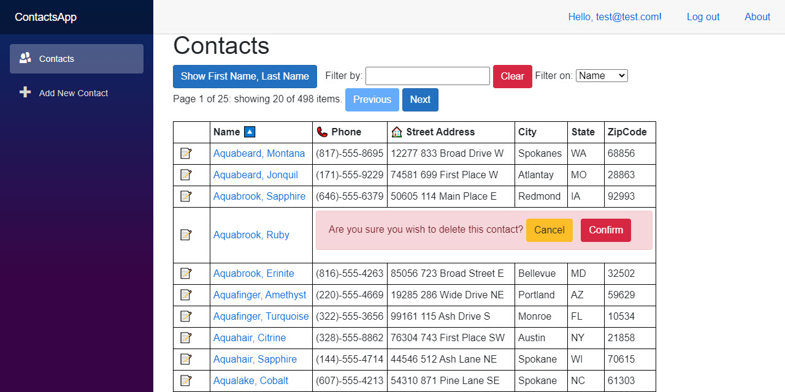

# BlazorWasmEFCoreExample



Example of a Blazor WebAssembly project that uses Entity Framework Core on the server for data access.

> Do you prefer Blazor Server instead? No problem! The same project is implemented for server [here](https://github.com/JeremyLikness/BlazorServerEFCoreExample).

I created this series of blog posts to explain the project in detail (note: series is valid up to commit 
[e6ac27b](https://github.com/JeremyLikness/BlazorWasmEFCoreExample/commit/e6ac27b5b2b2c1d40406aa34e8884ec8b0e5808a)):

- [Build a Blazor WebAssembly Line of Business App Part 1: Intro and Data Access](https://blog.jeremylikness.com/blog/build-a-blazor-webassembly-line-of-business-app/)
- [Build a Blazor WebAssembly Line of Business App Part 2: Client and Server](https://blog.jeremylikness.com/blog/build-a-blazor-webassembly-line-of-business-app-part-2/)
- [Build a Blazor WebAssembly Line of Business App Part 3: Query, Delete and Concurrency](https://blog.jeremylikness.com/blog/build-a-blazor-webassembly-line-of-business-app-part-3/)

For the latest version, read about the latest round of refactoring here:

- [Build a Blazor WebAssembly LOB App Part 4: Make it Blazor-Friendly](https://blog.jeremylikness.com/blog/build-a-blazor-webassembly-line-of-business-app-part-4/)

## Thank you

🙏 Thanks to [John Barrett](https://github.com/274188A) for helping identify initial issues.

## Features

* Application hosted authentication and registration
* Extended identity features to audit user creation, modification, email confirmation, and deletion
* Entity Framework Core
* Multiple data contexts
* Entity Framework Core logging
* Shadow properties: the database tracks row version, the user who created the entity and timestamp, and the user who last modified the entity and timestamp, without having to define these properties on the C# domain class
* Automatic audit that tracks changes with a before/after snapshot and is generated at the data context level
* Optimistic concurrency with delta resolution (when the database changes, the UI shows the changes so the user can overwrite or abort)
* Entity validation on the client and server using data annotations
* A grid that features paging, sorting, and filtering with debounce (i.e. typing three characters will result in just one database round trip)
* Dynamic filtering and sorting with serverside evaluation
* 99% of the UI is contained in a Razor class library that is usable from both Blazor WebAssembly and Blazor Server applications
* Example of the repository pattern: the client and server use the same interface with a different implementation
* Use of `IHttpClientFactory` to create a custom client with an authorization message handler

## Quick start

### Prerequisites

- .NET Core SDK ([3.1.300](https://dotnet.microsoft.com/download/dotnet-core/3.1) or later)
- Visual Studio Code, **OR**
- Visual Studio 2019 16.6 or later

### Code and Connection Strings

1. Optionally fork the repository.
1. Clone the repository (or your fork): 

   `git clone https://github.com/jeremylikness/BlazorWasmEFCoreExample.git`
1. If you don't have `localdb` installed, update `appsettings.json` and `appsettings.Development.json` in the `ContactsApp.Server` project to point to a valid database instance. 
1. The `DefaultConnection` is used for identity and can have any database name.
1. The `blazorcontactsdb` is used for the application database and must match `ContactContext.BlazorContactsDb` in the `ContactsApp.DataAccess` project (the default value is `blazorcontactsdb`).

### Visual Studio

1. Open the solution file.
1. Ensure the `ContactsApp.Server` project is set as the start up project.
1. Open the `NuGet Package Manager -> Package Manager Console`. 
1. In the console, with the server project selected, create the identity migration by typing:

    `Add-Migration -Context ApplicationAuditDbContext Initial`
1. After it is complete, apply the migration:

    `Update-Database -Context ApplicationAuditDbContext`
1. You are ready to launch the application.

See note at the end of the next section.

### Visual Studio Code

1. Navigate to the `ContactsApp/Server` folder.
1. If you haven't installed the EF Core Command Line Interface (CLI), install it by following [these instructions](https://docs.microsoft.com/ef/core/miscellaneous/cli/dotnet). Choose the latest stable version (the project file currently ships with version 3.1.4).
1. Run 

    `dotnet ef migrations add --context ApplicationAuditDbContext Initial` 
    
    to set up the identity database migrations.
1. Run 

    `dotnet ef database update --context ApplicationAuditDbContext` 
    
    to create the identity database.
1. Type 

   `dotnet run`
    
   to start the server. Navigate to the port specified.
  
> **Note**: the demo app is designed to create and populate the contacts database the first time you open the web page. This may result in a delay of up to several minutes on first load. This is normal and is just used to make setup easier. Subsequent runs should load faster.

## Migrations for Contacts Database

The context for contacts (`ContactContext`) resides in the `ContactsApp.DataAccess` assembly. It is a .NET Standard class library and cannot be executed directly. I created a `ContactContextFactory` in the `ContactsApp.Server` project to enable migrations by using the SQL Server provider and loading the connection string. To create a migration, you must specify the executable startup project and the context name. This command will create a migration in the `Migrations` folder named `InitialContact` (assuming this is run from the root of the solution directory):

```text
dotnet ef migrations add --startup-project ContactsApp/Server --context ContactContext InitialContact
```

Use the `--namespace` parameter to specify a different namespace to help avoid conflicts with the identity context.

---

Submit any feedback, questions, suggestions, or issues [here](https://github.com/JeremyLikness/BlazorWasmEFCoreExample/issues/new).

Regards,


[@JeremyLikness](https://twitter.com/JeremyLikness)
